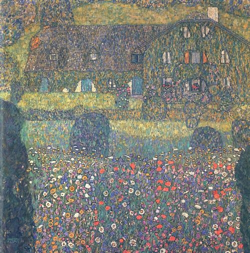
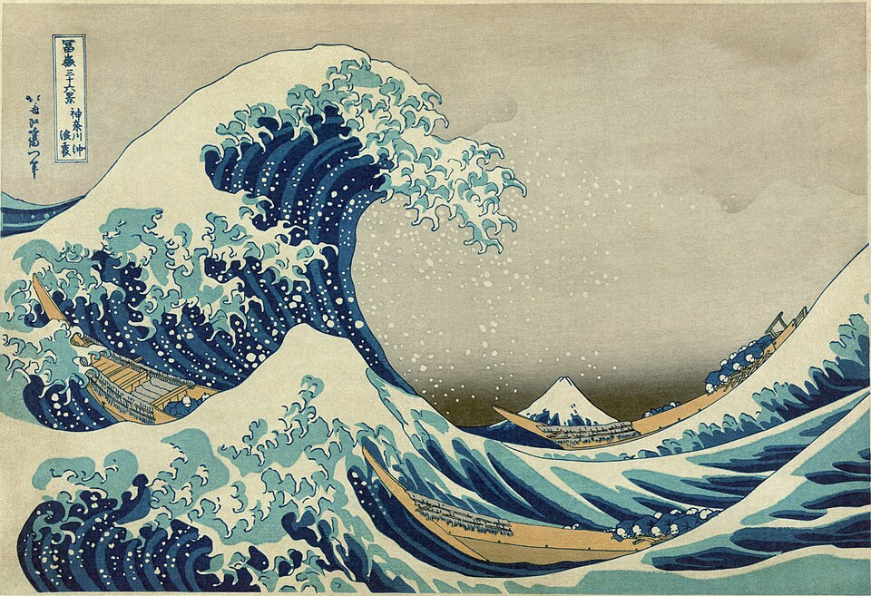
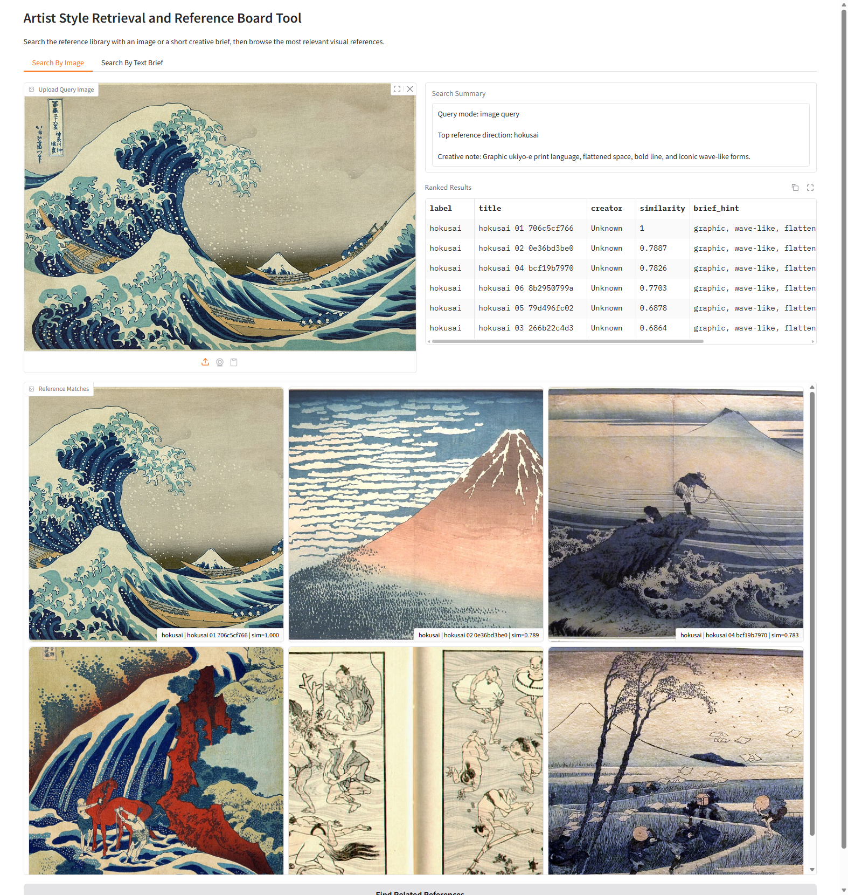
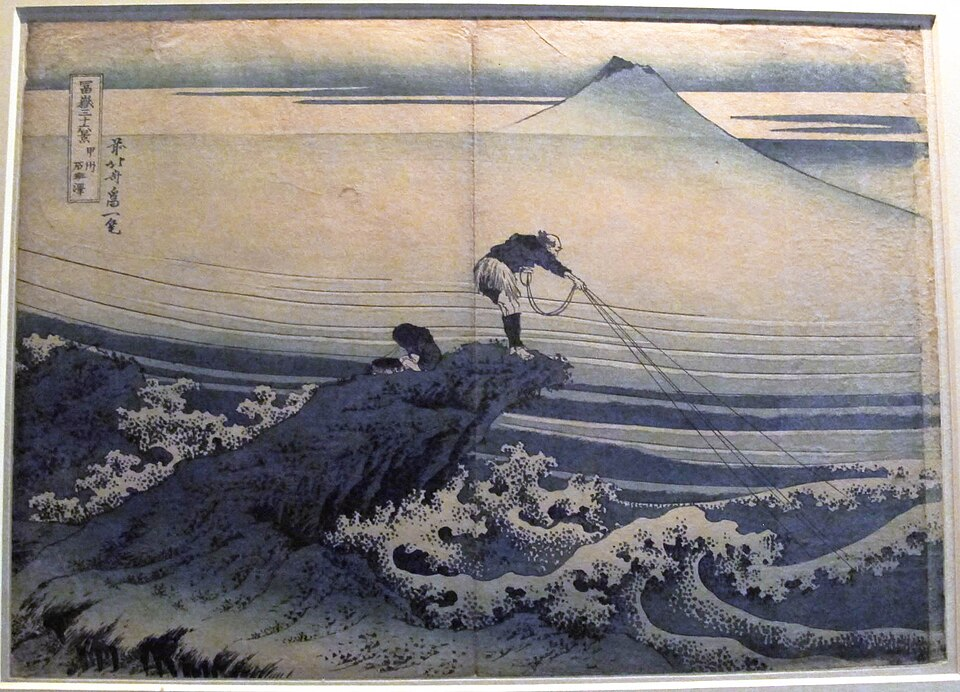
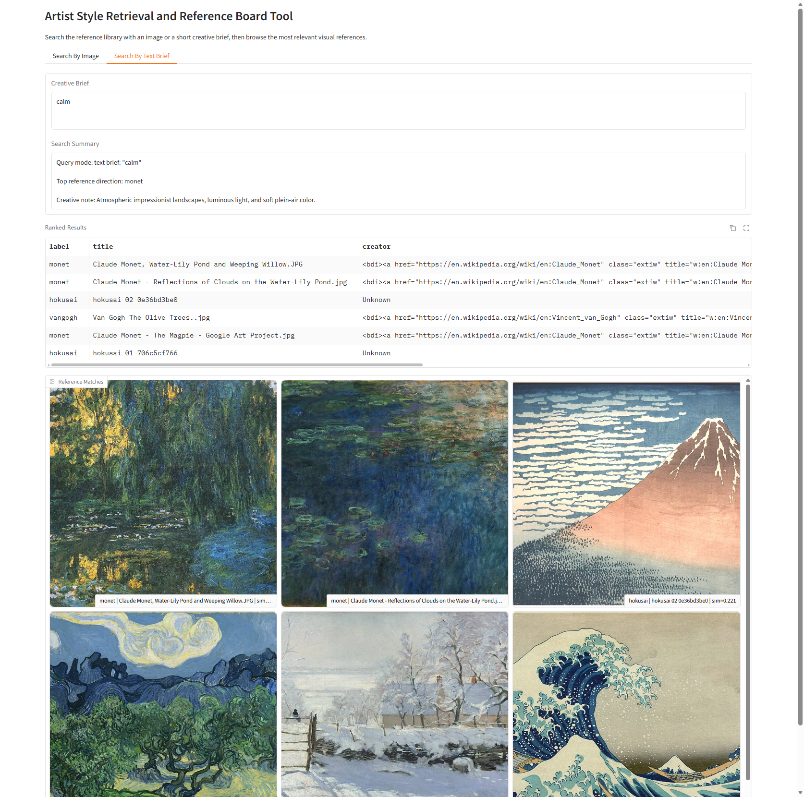

# EMI 2026 Final Project Weblog

This weblog records the iterative development of my final project: **Artist Style Retrieval and Reference Board Tool**.

## 2026-06-01 - Framing the project

At the start of the project I was still thinking in broad terms about "art style AI," but that was too vague to support a convincing final piece of work. I spent time narrowing the idea and decided that I did not want a classifier that simply announces a label. What interested me more was the moment before making: when a person is collecting visual references and trying to identify a direction.

That change in perspective became the foundation of the project. Instead of asking "what style is this image?" I reframed the problem as "what references should I look at next if I want images that feel visually related?" This immediately felt more relevant to creative practice and also made the task more realistic for a small prototype.

## 2026-06-03 - Defining the dataset

Once the concept became retrieval rather than classification, the next question was what kind of image library to build. I chose to start small with four artist groups: Monet, Van Gogh, Hokusai, and Klimt. I wanted four clusters that were visually distinctive enough to test retrieval, while still overlapping enough to create some ambiguity.

I also decided that a compact local dataset would be better than pretending to have a universal archive. A local dataset is easier to inspect, easier to explain in a final project, and more honest about the limits of the method. I planned to keep source metadata so that the references would not be anonymous images without context.

## 2026-06-05 - Choosing the embedding model

The key technical choice was the embedding model. I selected CLIP because it allows both images and text to be mapped into the same vector space. That meant the same system could support image-to-image retrieval and text-to-image retrieval without training a custom multimodal model from scratch.

This was a strong fit for the project because I wanted the interface to accept two kinds of query: an uploaded image and a short descriptive prompt. I was less interested in squeezing out maximum benchmark performance than in building a coherent workflow with a model that is already well suited to cross-modal similarity.

## 2026-06-07 - Building the catalog and retrieval pipeline

After settling on the model, I built the core project pipeline. I separated the work into stages so the project would be easier to reason about: first scan the image folders, then build a catalog, then compute embeddings, then save a retrieval bundle for runtime use. This also made the project easier to debug because I could test each step in isolation.

The catalog stage stores paths, titles, creator information, and label hints. The index stage uses CLIP to encode the reference images and saves the resulting vectors. I liked this structure because it turns the project into more than a single script: it becomes a small but understandable machine-learning workflow.

## 2026-06-09 - First interactive demo

With the retrieval pipeline working, I built the first version of the demo interface in Gradio. I wanted the interface to stay simple. The purpose was not to impress with visual complexity but to make the retrieval process visible and easy to test. I created two tabs: one for image queries and one for short text briefs.

The outputs were also kept straightforward: a summary box, a ranked results table, and a gallery of returned images. That layout made sense because it gave both an interpretable text summary and a more visual browsing experience. At this point the project finally felt like a usable tool rather than just a backend experiment.

## 2026-06-11 - Retrieval evaluation

I then turned to evaluation. This was a slightly awkward part of the project because style-related retrieval is not a task with a single objective truth. A strict label-accuracy framing would not really capture the creative value of the tool. Even so, I wanted at least one quantitative check to see whether the model and ranking pipeline were behaving sensibly.

I implemented a simple evaluation script that treats the folder labels as a proxy for relatedness. Each reference image is queried against the rest of the library, and I check whether results from the same label tend to appear near the top. This is not a perfect measure of artistic similarity, but it gave me a lightweight sanity check and a way to discuss the limits of evaluation in recommendation-like systems.

## 2026-06-13 - Revising the image library

Once I began testing the results more closely, I noticed that some retrieved sets felt narrower than I wanted. The clearest example was Hokusai. Too many of the available results leaned toward similar wave imagery, which made the gallery look repetitive and made the overall style cluster feel less diverse than it should have been.

I treated this as an important lesson rather than a minor inconvenience. In a retrieval system, dataset composition is part of the model behavior. If the library over-represents one motif, the system will keep surfacing it. I therefore revised the Hokusai set to include a wider range of scenes and subjects, so that the returned references better represented a style family rather than one famous icon.

## 2026-06-15 - Runtime and startup issues

While testing the demo more seriously, I ran into practical runtime problems. In some cases the page seemed unavailable even though the process had been started. After checking the behavior more carefully, I found that startup delay and local environment setup were the main causes. The CLIP model sometimes needed to load or download before the local page became responsive, which could make it look like the app had failed when it was actually still initializing.

I also had to deal with a second issue: if the image set changes but the retrieval index is not rebuilt, some returned results will point to outdated file paths. This caused missing images in the gallery during testing. I fixed this by rebuilding the catalog and the index after curating the updated dataset, and by treating data refresh plus index rebuild as a normal maintenance step rather than an afterthought.

## 2026-06-17 - Packaging for submission

As the project became more stable, I shifted from exploration to packaging. I trimmed the repository to the files that are actually useful for submission and review: the code, the README, the weblog, the launcher script, and the dependency list. Large local runtime assets such as downloaded images, cache files, and generated bundles were left out of the tracked repository because they can be recreated and would only make the submission harder to inspect.

I also checked the repository against the submission checklist. The project now has a public repository structure, a dated weblog, a README, and a run path that can be explained clearly in a short video. This packaging stage ended up being more important than I expected because a messy repository can make a finished technical idea look unfinished.

## 2026-06-18 - Final evaluation and reflection

At the final review stage, I felt that the project had become much clearer than the version I imagined at the beginning. The strongest improvement was conceptual. Reframing the project as a reference retrieval tool gave every later decision a more consistent purpose: the dataset design, the use of CLIP, the gallery-based interface, and the evaluation logic all fit together better.

The final system is still modest. It works on a small curated local library, not a large-scale live archive, and its notion of similarity is only as good as the data and embeddings allow. Even so, I think it succeeds as a final project because it combines a machine-learning workflow, a working interface, and a critical understanding of what the system can and cannot claim. If I continued it, I would expand the dataset, strengthen metadata and filtering, and experiment with user feedback to refine search quality over time.

